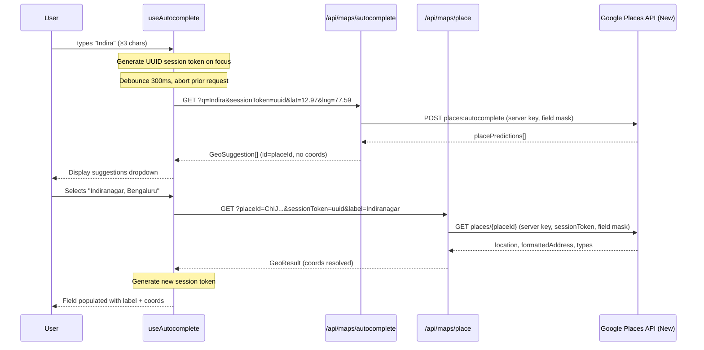
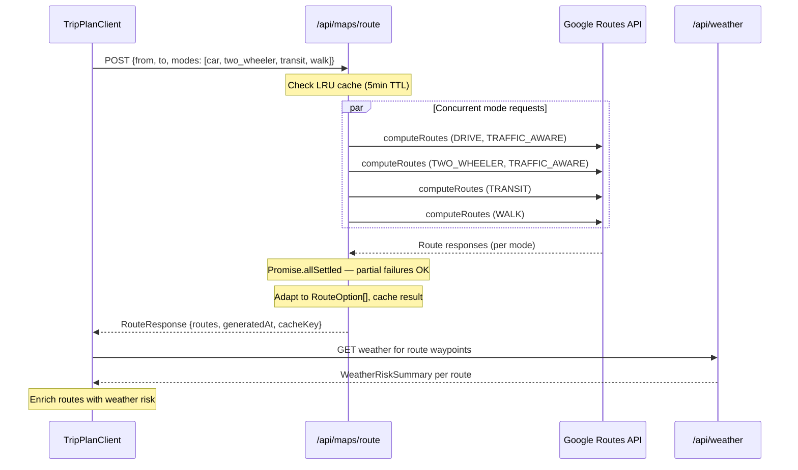
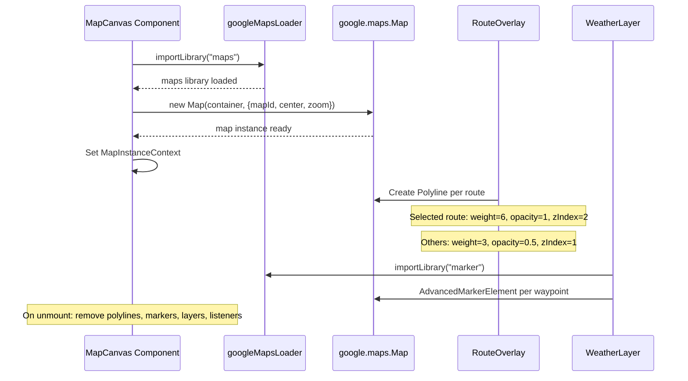

# Design Document: Google Maps Migration

## Overview

Rain-N-Route is a weather-enriched route planner built on Next.js 16. This migration replaces the entire current mapping stack — MapmyIndia (autocomplete/routing), Nominatim (geocoding), and MapLibre GL JS (rendering with OSM/CARTO tiles) — with a unified Google Maps Platform integration. Simultaneously, the `/dashboard` feature and all its dependent stores, components, and dependencies are removed.

The target architecture centralizes all billable Google API calls behind Next.js route handlers using a server-restricted key, while the browser uses only the Maps JavaScript API with a referrer-restricted browser key. Mock mode continues to operate without any external API keys, preserving the development and CI experience.

The migration is staged across 8 commits, each leaving the repository in a passing state. The design preserves the existing domain model boundary — UI components continue to consume `GeoSuggestion`, `GeoResult`, `RouteOption`, and `RouteResponse` types unchanged — while the provider layer beneath is wholly replaced.

## Architecture

### Current State

```mermaid
graph TD
    subgraph Browser
        UI[Planner UI / Route Cards]
        ML[MapLibre GL JS]
        OSM[OSM/CARTO Raster Tiles]
    end

    subgraph "Next.js Route Handlers"
        AC[/api/maps/autocomplete]
        GC[/api/maps/geocode]
        RG[/api/maps/reverse-geocode]
        RT[/api/maps/route]
        TR[/api/maps/traffic]
    end

    subgraph "External Providers"
        MMI[MapmyIndia API]
        NOM[Nominatim API]
        OWM[OpenWeatherMap API]
    end

    UI --> AC
    UI --> GC
    UI --> RG
    UI --> RT
    UI --> TR
    ML --> OSM

    AC --> MMI
    GC --> NOM
    RG --> NOM
    RT --> MMI
    TR --> MMI
```

### Target State

```mermaid
graph TD
    subgraph Browser
        UI[Planner UI / Route Cards]
        GM[Google Maps JavaScript API]
        ADV[Advanced Markers]
        TL[TrafficLayer / TransitLayer]
    end

    subgraph "Next.js Route Handlers"
        AC2[/api/maps/autocomplete]
        PL[/api/maps/place]
        GC2[/api/maps/geocode]
        RG2[/api/maps/reverse-geocode]
        RT2[/api/maps/route]
    end

    subgraph "Google Maps Platform"
        GPA[Places API - New]
        GGA[Geocoding API]
        GRA[Routes API]
        GMJS[Maps JS API]
    end

    subgraph "Weather"
        OWM2[OpenWeatherMap API]
    end

    UI --> AC2
    UI --> PL
    UI --> GC2
    UI --> RG2
    UI --> RT2
    GM --> GMJS
    ADV --> GMJS
    TL --> GMJS

    AC2 -->|Server Key| GPA
    PL -->|Server Key| GPA
    GC2 -->|Server Key| GGA
    RG2 -->|Server Key| GGA
    RT2 -->|Server Key| GRA
    GM -->|Browser Key| GMJS
```

## Sequence Diagrams

### Autocomplete + Place Resolution Flow



### Route Computation Flow



### Map Rendering Lifecycle



## Components and Interfaces

### Component 1: MapsProvider (Service Layer)

**Purpose**: Server-side abstraction for all Google Maps Platform web service calls. Adapts Google responses to domain types.

**Interface**:

```typescript
interface AutocompleteOptions {
  sessionToken: string;
  bias?: LatLng;
}

interface ResolvePlaceOptions {
  sessionToken: string;
  fallbackLabel: string;
}

interface MapsProvider {
  autocomplete(query: string, options: AutocompleteOptions): Promise<GeoSuggestion[]>;
  resolvePlace(placeId: string, options: ResolvePlaceOptions): Promise<GeoResult>;
  geocode(query: string): Promise<GeoResult[]>;
  reverseGeocode(coords: LatLng): Promise<GeoResult>;
  route(req: RouteRequest): Promise<RouteResponse>;
}
```

**Responsibilities**:

- Translate domain requests into Google API calls with explicit field masks
- Manage session tokens for Places billing optimization
- Normalize Google error responses to `ServiceErrorShape`
- Never expose raw Google responses beyond the provider boundary
- Never expose the server API key to client code

### Component 2: GoogleMapsLoader (Client Library)

**Purpose**: Singleton module managing the Maps JavaScript API script loading and library imports in the browser.

**Interface**:

```typescript
// src/lib/googleMapsLoader.ts

function initGoogleMaps(): void;
// Calls setOptions once with browser key and map ID

async function loadMapsLibrary(): Promise<google.maps.MapsLibrary>;
async function loadMarkerLibrary(): Promise<google.maps.MarkerLibrary>;

function isGoogleMapsConfigured(): boolean;
// Returns false when browser key or map ID is missing
```

**Responsibilities**:

- Initialize `@googlemaps/js-api-loader` with `NEXT_PUBLIC_GOOGLE_MAPS_BROWSER_KEY`
- Prevent duplicate script initialization
- Expose typed helpers for `maps` and `marker` library imports
- Normalize loader errors into user-facing error states
- Return configuration status for error boundary rendering

### Component 3: MapCanvas (Rendering)

**Purpose**: React component wrapping `google.maps.Map` instance. Replaces the MapLibre-based canvas.

**Interface**:

```typescript
interface MapCanvasProps {
  center: LatLng;
  zoom?: number;
  children?: React.ReactNode;
  onReady?: (map: google.maps.Map) => void;
  onError?: (error: Error) => void;
}
```

**Responsibilities**:

- Instantiate `google.maps.Map` once after mount using configured map ID
- Provide map instance through `MapInstanceContext`
- Render loading skeleton during initialization
- Render configuration/provider error state when keys are missing or loader fails
- Update center/zoom when props change without re-instantiation
- Clean up all listeners on unmount
- Use `role="application"` with accessible label for interactive map

### Component 4: RouteOverlay (Polylines)

**Purpose**: Renders `google.maps.Polyline` instances for each route, replacing MapLibre GeoJSON sources/layers.

**Interface**:

```typescript
interface RouteOverlayProps {
  routes: RouteOption[];
  selectedRouteId?: string;
  onRouteClick?: (routeId: string) => void;
}
```

**Responsibilities**:

- Decode encoded polylines to `google.maps.LatLngLiteral[]`
- Create one Polyline per route with mode-specific colors
- Apply selection styling (weight, opacity, zIndex) without recreating all polylines
- Attach click listeners for route selection
- Remove polylines and listeners on cleanup/route change

### Component 5: WeatherLayer (Advanced Markers)

**Purpose**: Places weather condition markers at sampled route waypoints using `AdvancedMarkerElement`.

**Interface**:

```typescript
interface WeatherLayerProps {
  routes: RouteOption[];
  selectedRouteId?: string;
}
```

**Responsibilities**:

- Load `marker` library lazily via `loadMarkerLibrary()`
- Create `AdvancedMarkerElement` with weather icon content at waypoints
- Remove markers and unmount React roots on route change
- Skip marker creation when geometry or weather risk is absent
- Requires configured map ID for Advanced Markers

### Component 6: MapControls (Layers & Navigation)

**Purpose**: Controls for traffic/transit layer switching, recenter, and fit-route.

**Interface**:

```typescript
interface MapControlsProps {
  activeLayer: 'base' | 'traffic' | 'transit';
  onLayerChange: (layer: 'base' | 'traffic' | 'transit') => void;
  onRecenter: () => void;
  onFitRoute: () => void;
}
```

**Responsibilities**:

- Attach/detach `google.maps.TrafficLayer` and `google.maps.TransitLayer` (mutually exclusive)
- Recenter: `map.panTo(center)` + `map.setZoom(12)`
- Fit route: extend `google.maps.LatLngBounds` with all route points, call `fitBounds`
- Clean up layers on unmount

### Component 7: API Route Handlers

**Purpose**: Next.js route handlers that proxy Google API calls, keeping the server key hidden from the browser.

**Routes**:

| Route                       | Method | Google API                | Purpose                  |
| --------------------------- | ------ | ------------------------- | ------------------------ |
| `/api/maps/autocomplete`    | GET    | Places Autocomplete (New) | Place predictions        |
| `/api/maps/place`           | GET    | Place Details (New)       | Resolve placeId → coords |
| `/api/maps/geocode`         | GET    | Geocoding API             | Forward geocode          |
| `/api/maps/reverse-geocode` | GET    | Geocoding API             | Reverse geocode          |
| `/api/maps/route`           | POST   | Routes API                | Compute routes           |

**Removed**:

- `/api/maps/traffic` — replaced by traffic-aware route durations and TrafficLayer

### Component 8: Environment Validation

**Purpose**: Typed module validating required environment variables at startup/request time.

```typescript
interface MapsConfig {
  serverKey: string; // GOOGLE_MAPS_SERVER_KEY
  browserKey: string; // NEXT_PUBLIC_GOOGLE_MAPS_BROWSER_KEY
  mapId: string; // NEXT_PUBLIC_GOOGLE_MAPS_MAP_ID
  isMockMode: boolean; // NEXT_PUBLIC_USE_MOCK_SERVICES === 'true'
}

function getMapsConfig(): MapsConfig;
// In mock mode: returns config without requiring Google keys
// In live mode: throws descriptive error if any required key is missing
// Never logs key values
```

## Data Models

### Domain Types (Unchanged at UI Boundary)

```typescript
// These types remain unchanged — the migration swaps the provider, not the contracts
interface GeoSuggestion {
  id: string; // Now: Google Place ID (was: provider-specific)
  label: string; // From structuredFormat.mainText.text
  secondary?: string; // From structuredFormat.secondaryText.text
  coords?: LatLng; // Undefined until Place Details resolves
}

interface GeoResult {
  id: string; // Google Place ID
  label: string; // From fallbackLabel or formattedAddress
  coords: LatLng; // From place.location
  placeType?: 'address' | 'poi' | 'locality' | 'station';
}
```

### Internal Google Response Types (New)

```typescript
// Internal types for type-safe adaptation — never exposed to UI components

interface GooglePlacePrediction {
  placeId: string;
  text: { text: string };
  structuredFormat: {
    mainText: { text: string };
    secondaryText: { text: string };
  };
  types: string[];
}

interface GoogleAutocompleteResponse {
  suggestions: Array<{
    placePrediction?: GooglePlacePrediction;
  }>;
}

interface GooglePlaceDetails {
  id: string;
  formattedAddress: string;
  location: { latitude: number; longitude: number };
  types: string[];
}

interface GoogleRouteResponse {
  routes: Array<{
    distanceMeters?: number;
    duration?: string; // e.g. "1234.5s"
    staticDuration?: string;
    polyline?: { encodedPolyline?: string };
    viewport?: object;
    legs: Array<{
      steps: GoogleRouteStep[];
    }>;
  }>;
}

interface GoogleRouteStep {
  distanceMeters?: number;
  staticDuration?: string;
  polyline?: { encodedPolyline?: string };
  navigationInstruction?: { instructions?: string };
  travelMode?: string;
  transitDetails?: GoogleTransitDetails;
}

interface GoogleTransitDetails {
  stopDetails: {
    arrivalStop: { name: string };
    departureStop: { name: string };
    arrivalTime: string;
    departureTime: string;
  };
  headsign: string;
  transitLine: {
    name: string;
    agencies: Array<{ name: string }>;
  };
  stopCount: number;
}
```

**Validation Rules**:

- All Google response types are validated before adaptation
- Missing optional fields default to safe values (0, empty string)
- Duration strings must match pattern `/^\d+(\.\d+)?s$/` or default to 0
- Coordinates must be valid latitude (-90 to 90) and longitude (-180 to 180)

### Mode Mapping Table

```typescript
const DOMAIN_TO_GOOGLE_MODE: Record<string, string> = {
  car: 'DRIVE',
  cab: 'DRIVE',
  auto: 'DRIVE',
  mixed: 'DRIVE',
  two_wheeler: 'TWO_WHEELER',
  transit: 'TRANSIT',
  walk: 'WALK',
  cycle: 'BICYCLE',
};

const GOOGLE_TO_DOMAIN_MODE: Record<string, TransportMode> = {
  DRIVE: 'car',
  TWO_WHEELER: 'two_wheeler',
  TRANSIT: 'transit',
  WALK: 'walk',
  BICYCLE: 'cycle',
};
```

### Removed Types (Dashboard Cleanup)

The following types are removed from `src/types/data-models.ts`:

- `SavedLocationKind`, `SavedLocation`
- `UserPreferences`, `WeatherSensitivity`
- `DayOfWeek`, `RecurringCommute`
- `CommuteLogEntry`, `WeeklyInsight`
- `PersistedState`
- `TileLayer`

Retained: all route, trip, weather, traffic, and service-error types used by the planner.

## Algorithmic Pseudocode

### Algorithm 1: Autocomplete Session Management

```typescript
ALGORITHM manageAutocompleteSession(inputField: 'from' | 'to')
INPUT: User keystrokes on a specific input field
OUTPUT: Ordered GeoSuggestion[] displayed to user

STATE:
  sessionToken: string = generateUUID()
  abortController: AbortController | null = null
  debounceTimer: Timer | null = null

ON_FOCUS(input is empty):
  sessionToken = generateUUID()

ON_INPUT_CHANGE(query: string):
  clearTimeout(debounceTimer)
  abortController?.abort()

  IF query.length < 3 THEN
    RETURN []  // Clear suggestions
  END IF

  debounceTimer = setTimeout(300ms, async () => {
    abortController = new AbortController()

    response = await fetch('/api/maps/autocomplete', {
      params: { q: query, sessionToken, lat: bias?.lat, lng: bias?.lng },
      signal: abortController.signal
    })

    RETURN response.suggestions  // GeoSuggestion[] with id=placeId, no coords
  })

ON_SELECT(suggestion: GeoSuggestion):
  result = await fetch('/api/maps/place', {
    params: { placeId: suggestion.id, sessionToken, label: suggestion.label }
  })
  // result now has resolved coords
  sessionToken = generateUUID()  // New session for next search
  RETURN result as GeoResult

ON_CLEAR():
  sessionToken = generateUUID()
```

### Algorithm 2: Google Route Computation with Partial Failure Tolerance

```typescript
ALGORITHM computeRoutes(req: RouteRequest)
INPUT: RouteRequest { from: LatLng, to: LatLng, modes: TransportMode[], departAt?: string }
OUTPUT: RouteResponse with routes for all successful modes

PRECONDITIONS:
  - from and to are valid coordinates
  - modes is non-empty
  - If departAt is provided, it is not in the past (for non-transit modes)

BEGIN
  // Step 1: Build per-mode Google requests
  googleRequests = []
  FOR EACH mode IN req.modes DO
    googleMode = DOMAIN_TO_GOOGLE_MODE[mode]
    IF googleMode is undefined THEN CONTINUE

    request = {
      origin: { location: { latLng: { latitude: from.lat, longitude: from.lng } } },
      destination: { location: { latLng: { latitude: to.lat, longitude: to.lng } } },
      travelMode: googleMode,
      computeAlternativeRoutes: false,
      polylineQuality: 'OVERVIEW',
      polylineEncoding: 'ENCODED_POLYLINE',
      languageCode: 'en-IN',
      regionCode: 'in',
      units: 'METRIC'
    }

    IF googleMode IN ['DRIVE', 'TWO_WHEELER'] THEN
      request.routingPreference = 'TRAFFIC_AWARE'
    END IF

    IF googleMode === 'TRANSIT' AND req.departAt THEN
      request.departureTime = req.departAt
    END IF

    googleRequests.push({ mode, request })
  END FOR

  // Step 2: Execute concurrently
  results = await Promise.allSettled(
    googleRequests.map(({ mode, request }) =>
      callGoogleRoutes(request).then(response => ({ mode, response }))
    )
  )

  // Step 3: Adapt successful responses
  routes: RouteOption[] = []
  errors: ServiceErrorShape[] = []

  FOR EACH result IN results DO
    IF result.status === 'fulfilled' THEN
      adapted = adaptGoogleRoute(result.value.response, result.value.mode, req)
      routes.push(adapted)
    ELSE
      errors.push(normalizeGoogleError(result.reason))
    END IF
  END FOR

  // Step 4: Handle total failure
  IF routes.length === 0 THEN
    THROW selectMostActionableError(errors)
  END IF

  RETURN {
    routes,
    generatedAt: new Date().toISOString(),
    cacheKey: buildCacheKey(req)
  }
END

POSTCONDITIONS:
  - At least one route is returned, OR an error is thrown
  - Each returned route retains the original domain mode
  - No raw Google response data leaks into RouteOption
```

### Algorithm 3: Google Duration Parsing

```typescript
ALGORITHM parseGoogleDuration(value: string | undefined)
INPUT: Google duration string (e.g. "3.5s", "1234s", undefined)
OUTPUT: Integer seconds

PRECONDITIONS:
  - value may be undefined, empty, or malformed

BEGIN
  IF value is undefined OR value is empty THEN
    RETURN 0
  END IF

  // Strip trailing 's' and parse as float
  numericPart = value.replace(/s$/, '')
  parsed = parseFloat(numericPart)

  IF isNaN(parsed) OR parsed < 0 THEN
    RETURN 0
  END IF

  RETURN Math.ceil(parsed)
END

POSTCONDITIONS:
  - Returns non-negative integer
  - Invalid inputs always produce 0, never throw
```

### Algorithm 4: Place Type Classification

```typescript
ALGORITHM classifyGooglePlaceTypes(types: string[])
INPUT: Array of Google Place type strings
OUTPUT: Domain placeType or undefined

BEGIN
  IF types includes 'train_station' OR 'transit_station' OR 'bus_station' THEN
    RETURN 'station'
  ELSE IF types includes 'point_of_interest' OR 'establishment' THEN
    RETURN 'poi'
  ELSE IF types includes 'street_address' OR 'premise' OR 'subpremise' THEN
    RETURN 'address'
  ELSE IF types includes 'locality' OR 'sublocality' OR 'administrative_area_level_1' THEN
    RETURN 'locality'
  ELSE
    RETURN undefined
  END IF
END

POSTCONDITIONS:
  - Returns one of the domain placeType values or undefined
  - Priority order: station > poi > address > locality
```

## Key Functions with Formal Specifications

### Function: adaptGoogleRoute()

```typescript
function adaptGoogleRoute(
  googleRoute: GoogleRouteResponse['routes'][0],
  domainMode: TransportMode,
  originalReq: RouteRequest,
): RouteOption;
```

**Preconditions:**

- `googleRoute` is non-null and has at least one leg
- `domainMode` is a valid `TransportMode`
- `originalReq` contains valid from/to coordinates

**Postconditions:**

- Returns a valid `RouteOption` with all required fields populated
- `result.modes[0]` equals `domainMode` (preserves original domain mode)
- `result.geometry` is a valid encoded polyline string or empty string
- `result.totalDuration` is a non-negative integer (seconds)
- `result.totalDistance` is a non-negative integer (meters)
- `result.id` is deterministic given the same inputs
- No Google-specific types or field names appear in the output

**Loop Invariants:**

- For step adaptation loop: all previously adapted steps have valid duration and distance

### Function: normalizeGoogleError()

```typescript
function normalizeGoogleError(error: unknown): ServiceErrorShape;
```

**Preconditions:**

- `error` can be any thrown value (Error, HTTP response, network failure)

**Postconditions:**

- Returns a valid `ServiceErrorShape`
- Never includes API keys, headers, or request URLs in `message`
- `retryable` is true only for transient errors (timeout, 429, 503)
- Mapping: 400→VALIDATION_ERROR, 403→PROVIDER_ERROR, 404→NOT_FOUND, 429→RATE_LIMITED, timeout→PROVIDER_TIMEOUT, network→NETWORK_OFFLINE

### Function: buildCacheKey()

```typescript
function buildCacheKey(req: RouteRequest): string;
```

**Preconditions:**

- `req.from` and `req.to` have valid lat/lng
- `req.modes` is a non-empty array

**Postconditions:**

- Deterministic: same logical request produces same cache key
- Coordinates are rounded to 4 decimal places (11m precision)
- Modes are sorted alphabetically before hashing
- Departure time is bucketed to 5-minute intervals (or omitted if absent)
- Key format is human-debuggable (not just a hash)

### Function: initGoogleMaps()

```typescript
function initGoogleMaps(): void;
```

**Preconditions:**

- Called once during application initialization (client-side only)
- `NEXT_PUBLIC_GOOGLE_MAPS_BROWSER_KEY` is available in env

**Postconditions:**

- `@googlemaps/js-api-loader` setOptions called exactly once
- Subsequent calls are no-ops (idempotent)
- No network request is made until `importLibrary` is called
- Throws descriptive error if browser key is missing (non-mock mode)

## Example Usage

### Autocomplete Hook (Updated)

```typescript
// src/hooks/useAutocomplete.ts — updated interface
export function useAutocomplete(
  query: string,
  sessionToken: string,
  bias?: LatLng,
  debounceMs = 300,
): UseAutocompleteResult {
  // ... debounce, abort, fetch logic ...
  // Now passes sessionToken and bias to /api/maps/autocomplete
  // Returns GeoSuggestion[] where id is a Google Place ID
  // coords is undefined — must call resolvePlace after selection
}

// Usage in AddressAutocomplete component
const { sessionToken, resetSession } = useSessionToken();
const { suggestions, loading } = useAutocomplete(query, sessionToken, userLocation);

async function handleSelect(suggestion: GeoSuggestion) {
  const resolved = await resolvePlace(suggestion.id, sessionToken, suggestion.label);
  resetSession(); // Generate new token for next search
  onLocationSelected(resolved);
}
```

### Google Maps Provider (Server-side)

```typescript
// src/services/maps/google.ts
export class GoogleMapsProvider implements MapsProvider {
  private serverKey: string;

  constructor(serverKey: string) {
    this.serverKey = serverKey;
  }

  async autocomplete(query: string, options: AutocompleteOptions): Promise<GeoSuggestion[]> {
    const response = await fetch('https://places.googleapis.com/v1/places:autocomplete', {
      method: 'POST',
      headers: {
        'Content-Type': 'application/json',
        'X-Goog-Api-Key': this.serverKey,
        'X-Goog-FieldMask': AUTOCOMPLETE_FIELD_MASK,
      },
      body: JSON.stringify({
        input: query.trim(),
        sessionToken: options.sessionToken,
        includedRegionCodes: ['in'],
        ...(options.bias && {
          locationBias: {
            circle: {
              center: { latitude: options.bias.lat, longitude: options.bias.lng },
              radius: 50000,
            },
          },
        }),
      }),
    });

    if (!response.ok) throw await this.buildError(response);
    const data: GoogleAutocompleteResponse = await response.json();
    return this.adaptAutocomplete(data);
  }

  async resolvePlace(placeId: string, options: ResolvePlaceOptions): Promise<GeoResult> {
    const url = `https://places.googleapis.com/v1/places/${placeId}?sessionToken=${options.sessionToken}&languageCode=en&regionCode=IN`;
    const response = await fetch(url, {
      headers: {
        'X-Goog-Api-Key': this.serverKey,
        'X-Goog-FieldMask': 'id,formattedAddress,location,types',
      },
    });

    if (!response.ok) throw await this.buildError(response);
    const place: GooglePlaceDetails = await response.json();
    return {
      id: place.id,
      label: options.fallbackLabel || place.formattedAddress,
      coords: { lat: place.location.latitude, lng: place.location.longitude },
      placeType: classifyGooglePlaceTypes(place.types),
    };
  }

  async route(req: RouteRequest): Promise<RouteResponse> {
    // Uses Algorithm 2: computeRoutes with Promise.allSettled
    // See Algorithmic Pseudocode section above
  }
}
```

### MapCanvas (Google Maps)

```typescript
// src/components/map/MapCanvas.tsx — rewritten
'use client';

export function MapCanvas({ center, zoom = 12, children, onReady, onError }: MapCanvasProps) {
  const containerRef = useRef<HTMLDivElement>(null);
  const mapRef = useRef<google.maps.Map | null>(null);
  const [mapInstance, setMapInstance] = useState<google.maps.Map | null>(null);
  const [status, setStatus] = useState<'loading' | 'ready' | 'error'>('loading');

  useEffect(() => {
    if (!containerRef.current) return;
    if (!isGoogleMapsConfigured()) {
      setStatus('error');
      return;
    }

    let cancelled = false;

    async function init() {
      try {
        const { Map } = await loadMapsLibrary();
        if (cancelled || !containerRef.current) return;

        const map = new Map(containerRef.current, {
          center: { lat: center.lat, lng: center.lng },
          zoom,
          mapId: process.env.NEXT_PUBLIC_GOOGLE_MAPS_MAP_ID,
          disableDefaultUI: false,
          gestureHandling: 'greedy',
        });

        mapRef.current = map;
        setMapInstance(map);
        setStatus('ready');
        onReady?.(map);
      } catch (err) {
        if (!cancelled) {
          setStatus('error');
          onError?.(err instanceof Error ? err : new Error('Map load failed'));
        }
      }
    }

    init();
    return () => {
      cancelled = true;
    };
  }, []);

  // Render loading/error/map states...
}
```

## Correctness Properties

_A property is a characteristic or behavior that should hold true across all valid executions of a system — essentially, a formal statement about what the system should do. Properties serve as the bridge between human-readable specifications and machine-verifiable correctness guarantees._

### Property 1: Key Isolation

_For any_ response returned by any Route_Handler, and _for any_ error message produced by the Google_Provider, the response body and error message SHALL never contain the value of `GOOGLE_MAPS_SERVER_KEY`, any API key substring, internal request URLs, or Google request headers.

**Validates: Requirements 2.5, 13.8, 14.1**

### Property 2: Session Token Billing Optimization

_For any_ autocomplete-to-place-resolution flow on a single input field, the same session token is used for all autocomplete requests AND the final Place Details call within that search session. A new token is generated after selection, clear, or focus-on-empty. From and To fields maintain independent tokens.

**Validates: Requirements 4.2, 4.4**

### Property 3: Partial Failure Tolerance

_For any_ route request with N modes where K modes succeed (1 ≤ K < N), the response contains exactly K routes. Failed modes are silently excluded without affecting successful modes.

**Validates: Requirements 6.2, 13.3**

### Property 4: Domain Type Preservation

_For any_ `RouteOption` object returned to UI components after adaptation from a Google route response, `option.modes[0]` is always the originally-requested domain mode (e.g., `'car'`), never a Google enum (e.g., `'DRIVE'`). No Google-specific field names or enum values appear in the returned domain types.

**Validates: Requirements 6.4, 14.3**

### Property 5: Mock Mode Isolation

_For any_ provider operation (autocomplete, resolvePlace, geocode, reverseGeocode, route) called while `NEXT_PUBLIC_USE_MOCK_SERVICES=true`, zero HTTP requests are made to any `*.googleapis.com` or `*.gstatic.com` domain, and all operations return deterministic fixture data without requiring Google API keys.

**Validates: Requirements 2.2, 12.1, 12.2**

### Property 6: Coordinate Resolution Guarantee

_For any_ place suggestion selected by the user, `resolvePlace` is called before route computation, and the resulting `GeoResult` contains valid coordinates. No route request is made with undefined coordinates.

**Validates: Requirements 3.5, 3.6**

### Property 7: Layer Exclusivity

_For any_ sequence of layer switches (base, traffic, transit), at most one overlay layer (TrafficLayer OR TransitLayer) is attached to the map at any given time. Selecting a new layer detaches the previous one.

**Validates: Requirements 11.4**

### Property 8: Cleanup Completeness

_For any_ set of map objects created during a component's lifecycle (polylines, markers, layers, event listeners), on component unmount ALL polyline instances have `setMap(null)` called, ALL `AdvancedMarkerElement` instances are removed, ALL event listeners are detached, and ALL layers are detached.

**Validates: Requirements 8.5, 9.4, 10.3, 11.5**

### Property 9: Field Mask Compliance

_For any_ Google API request constructed by the Google_Provider (autocomplete, place details, geocode, route), the field mask does not contain the wildcard character `*`. All requests specify exactly the fields consumed by the adapter.

**Validates: Requirements 3.8, 6.9**

### Property 10: Cache Key Determinism

_For any_ two route requests with identical coordinates (rounded to 4 decimal places), identical modes (sorted alphabetically), and identical departure time bucket (5-minute intervals), `buildCacheKey` produces identical cache key strings. The function is idempotent.

**Validates: Requirements 7.2, 7.4**

### Property 11: Duration Parsing Correctness

_For any_ valid Google duration string matching the pattern `/^\d+(\.\d+)?s$/`, `parseGoogleDuration` returns `Math.ceil` of the numeric value as a non-negative integer. _For any_ invalid, empty, or undefined input, the function returns 0 and never throws.

**Validates: Requirements 6.10**

### Property 12: Autocomplete Adaptation Completeness

_For any_ valid `GoogleAutocompleteResponse` containing K place predictions (where each prediction has a non-empty `placeId` and `structuredFormat`), the adapter returns exactly K `GeoSuggestion` objects, each with `id` equal to the Google Place ID, a non-empty `label`, and `coords` set to undefined.

**Validates: Requirements 3.4**

### Property 13: Routing Preference Correctness

_For any_ route request where the domain mode maps to Google `DRIVE` or `TWO_WHEELER`, the constructed Google request includes `routingPreference: 'TRAFFIC_AWARE'`. _For any_ route request where the domain mode maps to `WALK`, `BICYCLE`, or `TRANSIT`, the constructed Google request does not include a `routingPreference` field.

**Validates: Requirements 6.5, 6.6**

### Property 14: Error Normalization Consistency

_For any_ Google API error response with HTTP 429 or status `RESOURCE_EXHAUSTED`, the normalized error is `RATE_LIMITED` with `retryable: true`. _For any_ HTTP 403 or `REQUEST_DENIED`, the normalized error is `PROVIDER_ERROR` with no key values in the message. The normalization mapping is deterministic and complete for all Google error statuses.

**Validates: Requirements 5.4, 5.5, 13.6, 13.7**

### Property 15: Route Overlay Fidelity

_For any_ set of N routes with valid encoded polyline geometry, the Route_Overlay creates exactly N `google.maps.Polyline` instances. The selected route's polyline has strictly greater stroke weight, opacity, and z-index than all unselected route polylines.

**Validates: Requirements 9.1, 9.2**

## Error Handling

### Error Scenario 1: Google API Key Missing (Live Mode)

**Condition**: `GOOGLE_MAPS_SERVER_KEY` is undefined when a route handler receives a request in non-mock mode.
**Response**: Return HTTP 500 with `{ error: { code: 'PROVIDER_ERROR', message: 'Maps service not configured' } }`. Never reveal which key is missing.
**Recovery**: Request fails; UI shows standard error state. Developer checks env configuration.

### Error Scenario 2: Places API Quota Exceeded

**Condition**: Google returns HTTP 429 or `RESOURCE_EXHAUSTED` status.
**Response**: Normalize to `RATE_LIMITED` with `retryable: true`. API route returns HTTP 429.
**Recovery**: Client may retry after backoff. Autocomplete field remains editable with previously typed text. No data loss.

### Error Scenario 3: Partial Route Mode Failure

**Condition**: One or more modes fail (e.g., TWO_WHEELER unavailable in a region) while others succeed.
**Response**: `Promise.allSettled` captures all results. Successful routes are returned normally. Failed modes are logged server-side but not surfaced to user.
**Recovery**: UI displays available routes. Missing mode simply doesn't appear in route cards.

### Error Scenario 4: Map JavaScript API Load Failure

**Condition**: Network error, invalid browser key, or script blocked by content security policy.
**Response**: MapCanvas renders error state with message. Route cards remain fully functional.
**Recovery**: Map panel shows "Map unavailable" with retry option. User can still plan trips using route cards and step-by-step directions.

### Error Scenario 5: Place Resolution Failure After Selection

**Condition**: User selects a suggestion but Place Details API returns error.
**Response**: Input field retains the selected label text. Error toast displayed. Field remains editable for retry.
**Recovery**: User can re-select the same suggestion or type a new query. Previously resolved locations are unaffected.

## Testing Strategy

### Unit Testing Approach

Framework: Vitest with jsdom

**Key test cases:**

- `parseGoogleDuration`: valid strings, decimal seconds, undefined, empty, negative, no suffix
- `classifyGooglePlaceTypes`: all priority combinations, empty array, unknown types
- `DOMAIN_TO_GOOGLE_MODE` / `GOOGLE_TO_DOMAIN_MODE`: bidirectional mapping correctness
- `adaptGoogleRoute`: complete route, missing fields, transit details, step flattening
- `buildCacheKey`: determinism, coordinate rounding, mode sorting, time bucketing
- `normalizeGoogleError`: each HTTP status code, network errors, timeout errors
- Autocomplete session lifecycle: token generation, reset on select/clear/focus
- Map overlay cleanup: polyline setMap(null), marker removal, listener detachment
- Layer exclusivity: only one overlay active at a time
- Loader initialization: idempotent, error when key missing

### Property-Based Testing Approach

**Property Test Library**: fast-check

**Properties to verify:**

- For any valid Google duration string matching `/^\d+(\.\d+)?s$/`, `parseGoogleDuration` returns a positive integer equal to `Math.ceil` of the numeric value.
- For any `RouteRequest` with N modes, the response contains at most N routes, each with a distinct domain mode.
- For any pair of coordinates rounded to 4 decimals and sorted mode array, `buildCacheKey` is idempotent.
- For any `GoogleAutocompleteResponse` with K valid predictions, exactly K `GeoSuggestion` items are returned with non-empty labels.

### Integration Testing Approach

Framework: Vitest + MSW (Mock Service Worker)

**MSW handlers simulate Google API responses for:**

- Places Autocomplete: success, empty, malformed prediction, 400, 403, 429, 500, timeout
- Place Details: success, missing location, invalid placeId, quota error
- Forward geocode: success, zero results
- Reverse geocode: success, zero results
- Routes (per mode): DRIVE, TWO_WHEELER, TRANSIT, WALK success
- Routes edge cases: decimal-second durations, partial mode failure, total failure
- Field mask validation: handlers reject requests with `*` mask or missing mask header
- Key leakage: handlers verify no server key appears in response bodies

### E2E Testing Approach

Framework: Playwright

**Flows (all in mock mode):**

1. Home page loads without dashboard navigation
2. `/dashboard` returns 404
3. Autocomplete search → select From and To
4. Submit and receive multiple route options
5. Route cards display weather enrichment
6. Sort mode change re-orders cards
7. Route selection from card list
8. Mobile map tab switch
9. Map adapter shows selected route
10. Share-trip link round-trip

### Security Testing

- Build output scan: `GOOGLE_MAPS_SERVER_KEY` not in `.next/static/`
- API error responses: no key values echoed
- Mock mode: zero network calls to Google domains (MSW passthrough check)

## Performance Considerations

- **Autocomplete debounce**: 300ms prevents excessive API calls during fast typing
- **Session tokens**: Group autocomplete + place detail into one billing session
- **Route caching**: 5-minute LRU prevents duplicate requests for same origin/destination
- **Concurrent mode requests**: `Promise.allSettled` executes all 4 route modes in parallel
- **Polyline quality**: `OVERVIEW` reduces response size vs `HIGH_QUALITY`
- **Traffic routing**: `TRAFFIC_AWARE` (not `TRAFFIC_AWARE_OPTIMAL`) balances cost vs accuracy
- **Lazy marker loading**: `marker` library loaded only when weather data is available
- **Field masks**: Narrow masks reduce response payload and billing charges

## Security Considerations

- **Key separation**: Browser key restricted to Maps JS API + HTTP referrers. Server key restricted to Places/Routes/Geocoding + never exposed to client.
- **No key in responses**: API route handlers strip all headers and return only adapted domain types
- **No key in logs**: Environment validation module never logs key values
- **No key in build**: Server key has no `NEXT_PUBLIC_` prefix; Next.js tree-shaking excludes it from client bundles
- **Input validation**: All API route parameters validated with Zod before Google calls
- **Rate limiting**: Google Cloud quota settings serve as hard limits; app-level debounce reduces call volume
- **CORS**: API routes only accessible from same origin (Next.js default)

## Dependencies

### Added

| Package                     | Purpose                               |
| --------------------------- | ------------------------------------- |
| `@googlemaps/js-api-loader` | Load Maps JavaScript API in browser   |
| `@types/google.maps`        | TypeScript types for Google Maps APIs |

### Removed

| Package          | Reason                                 |
| ---------------- | -------------------------------------- |
| `maplibre-gl`    | Replaced by Google Maps JavaScript API |
| `recharts`       | Dashboard-only dependency              |
| `idb-keyval`     | Dashboard persistence only             |
| `fake-indexeddb` | Test support for idb-keyval            |

### Retained

| Package                 | Reason                             |
| ----------------------- | ---------------------------------- |
| `zustand`               | tripStore still active             |
| `zod`                   | Parameter validation in API routes |
| `lru-cache`             | Route response caching             |
| `msw`                   | Integration test mocking           |
| All weather/UI packages | Unchanged functionality            |

## Migration Stages

### Stage 0: Baseline + Fixtures/Contracts

- Record passing test counts
- Add Google response type definitions
- Add Google response fixture JSON files
- No behavioral changes

### Stage 1: Dashboard Removal

- Delete `/dashboard` route, components, stores, types
- Remove orphaned planner widgets (QuickLocationChips, TodaysCommuteCard)
- Remove BottomNav, simplify Header
- Remove recharts, idb-keyval, fake-indexeddb
- Retain tripStore and planner functionality

### Stage 2: Google Server Provider

- Add environment validation module
- Implement `GoogleMapsProvider` (autocomplete, resolvePlace, geocode, reverseGeocode, route)
- Update `MapsProvider` interface (remove trafficFor, tilesUrl; add resolvePlace)
- Update `MockMapsProvider` to new interface
- Integration tests via MSW — no live API calls

### Stage 3: Planner Place Flow

- Add `/api/maps/place` route handler
- Add session token hook (`useSessionToken`)
- Update `useAutocomplete` to pass sessionToken and bias
- Update `AddressAutocomplete` for place resolution flow
- Update geolocation reverse lookup

### Stage 4: Routing Switch + MapmyIndia Removal

- Wire `GoogleMapsProvider` as live provider
- Complete route adaptation for all 4 modes
- Delete MapmyIndia provider, Nominatim provider, traffic endpoint
- Delete all MapmyIndia/Nominatim fixtures and tests

### Stage 5: MapLibre → Google Maps Rendering

- Add `googleMapsLoader.ts`
- Rewrite `MapCanvas` around `google.maps.Map`
- Rewrite `RouteOverlay` with `google.maps.Polyline`
- Rewrite `WeatherLayer` with `AdvancedMarkerElement`
- Rewrite `MapControls` with TrafficLayer/TransitLayer
- Remove `maplibre-gl` dependency

### Stage 6: Docs, Privacy, CI, Cleanup

- Update `.env.example` with new variables
- Update privacy page
- Update CI workflow
- Update README
- Remove obsolete env references

### Stage 7: E2E Verification

- Add/update Playwright tests for full planner flow
- Verify all mock-mode paths
- Run complete test suite

### Stage 8: Manual Live Verification

- Owner-performed with real keys
- Not automated in CI
